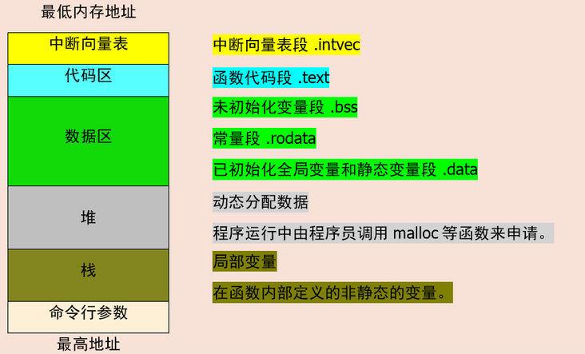
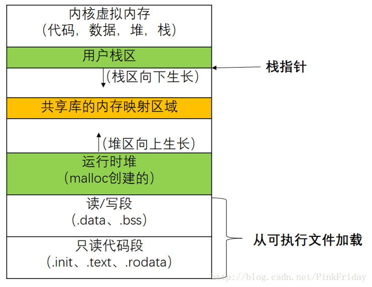
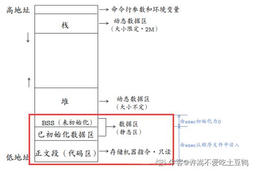
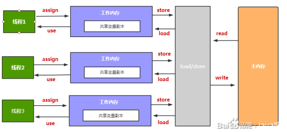
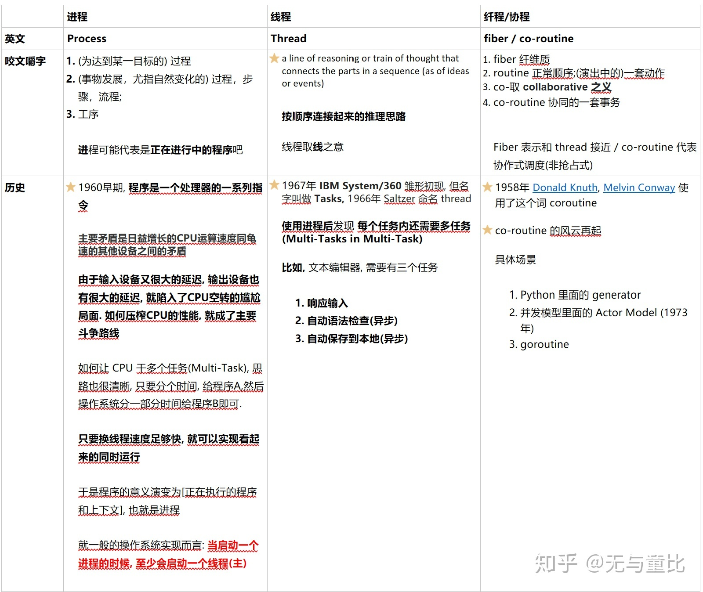
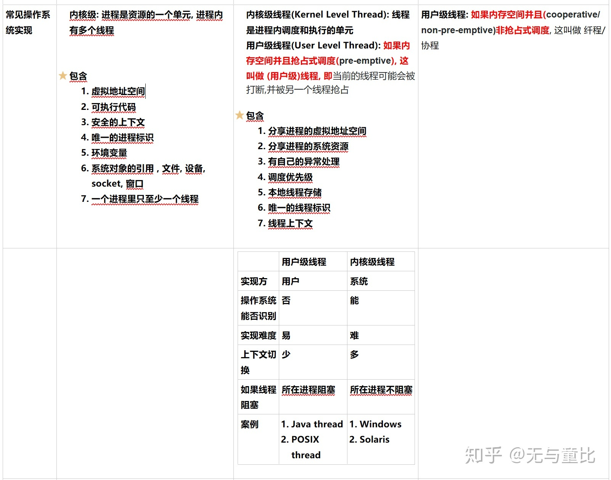
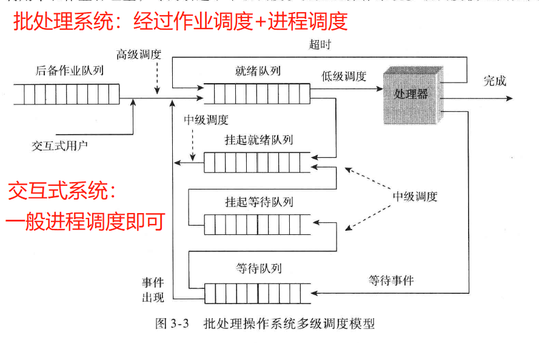
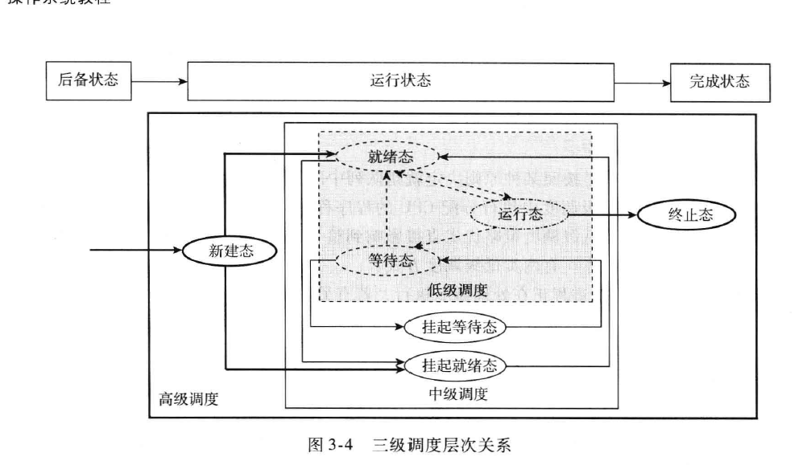
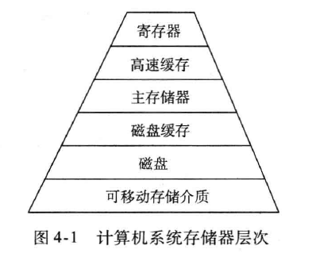

[toc]

```html
<!---分栏代码--->
<table style="margin:auto;">
    <tr>
        <td>
            左侧
        </td>
        <td>
            右侧
        </td>
    </tr>
</table>
```

## STL

### sort

>  **STL的sort算法，数据量大时采用QuickSort快排算法，分段归并排序。一旦分段后的数据量小于某个门槛（16），为避免QuickSort快排的递归调用带来过大的额外负荷，就改用Insertion Sort插入排序。如果递归层次过深，还会改用HeapSort堆排序。**

- 那堆排序既然也是O(nlogn）直接用堆排序实现sort不行吗？为啥用快速排序实现？

    ① 堆排序有很多无用的比较。

    ② 堆排序元素乱序访问，快速排序顺序访问，有利于 CPU 缓存。

- 复杂度

    平均：$O(n\log n)$

    最坏（有序时）：$O(n^2)$

    空间复杂度：$O(\log n)$到$ O(n\log n)$

- 为什么不用归并呢？

    ① 依然是 CPU 缓存问题

    ② 归并空间复杂度固定为$O(n)$


### 术语

- ROI pooling (region of interest)：感兴趣区域池化层

## 基础知识

### C 和 C++


### 位运算

- 1 xor 2 xor 3 xor 4 ...... xor N 有如下规律：
    - N % 4 == 0，结果为 N
    - N % 4 == 1，结果为 1
    - N % 4 == 2，结果为 N + 1
    - N % 4 == 3，结果为 0
- 

### 同步、异步、阻塞、非阻塞（对于调用过程而言）

- **同步：**当一个同步调用发出后，调用者要一直等待返回结果。通知后，才能进行后续的执行。 

- **异步：**当一个异步过程调用发出后，调用者不能立刻得到返回结果。实际处理这个调用的部件在完成后，通过状态、通知和回调来通知调用者。 

- **阻塞：**是指调用结果返回前，当前线程会被挂起，即阻塞。 

- **非阻塞：**是指即使调用结果没返回，也不会阻塞当前线程。

### 程序的生成过程


### 内存结构

#### **bss 段**

block started by symbol，指**未初始化**和**初始化为 0 的全局变量和静态变量**，可执行文件中，只记录该段大小，不实际记录数据。因此不占文件大小，但占执行时内存大小。

#### **data 段**

data 指那些初始化过（非零）的非 const 的全局变量和静态变量。

#### **rodata 段**

只读数据段，存放常量，字符常量，const常量，据说还存放调试信息。常量不一定全放这里，也有可能放在代码段（.text）中。rodata 是在多个线程间是共享的。

#### **text 段**

指用来存放程序执行代码的一块内存区域。只读且共享，也可能包含一些常量，如字符串常量等。


#### C++ 中分为**栈、堆、全局存储区、代码区。**

- 栈：程序运行时自动分配
- 堆：程序员手动分配
- 全局存储区：全局变量，静态变量，各种常量（字符串常量、const 常量等）
- 代码区：存放 cpu 执行的指令，共享且只读。

**下面是一个 C 程序的内存模型、或一个进程的内存模型：**

<details>
<summary><font size="2" color="#6bcafb">各个便于理解的模型图如下</font></summary>
	
	
    
    
</details>


### 堆和栈

- 空间分配方式不同
    - 栈：由**操作系统（编译器）自动分配释放** ，存放函数的参数值，局部变量的值等。
    - 堆：一般由**程序员分配释放**， 若程序员不释放，程序结束时可能由OS回收。理论上达到 2^n 大小
- 缓存方式不同
    - 栈：栈使用的是一级缓存， 它们通常都是被调用时处于存储空间中，调用完毕立即释放。
    - 堆：存放在二级缓存中，生命周期由程序的垃圾回收算法来决定（并不是一旦成为孤儿对象就能被回收）
- 分配效率不同
    - 栈：分配快，底层硬件支持，可看汇编
    - 堆：分配慢，需要根据分配策略寻找位置，产生碎片
- 生长方式不同
    - 栈：向下生长
    - 堆：向上生长

### 系统调用

- **什么是系统调用？**

    系统调用是OS 提供给用户编程时的一些公共子程序，一般为函数或方法。

- **为什么要用系统调用？**

    OS 为了安全的管理计算机软硬件资源，不允许程序员直接操作系统资源，比如（进程、内存、I/O、文件）。但是用户可以通过系统调用请求这些资源

- **如何使用系统调用？系统调用的过程？**

    用户像调用普通函数一样，传递系统调用参数。产生软中断，从用户态切换到内核态，并将返回地址压栈，执行内核服务后，出栈返回。

### CPU 原子操作

1. 总线锁。缺点：锁总线，导致其它 CPU 和总线的通信受阻，降低效率。
2. 缓存锁。两种情况不能用：
    - 数据不能被缓存，或数据跨多个缓存行（cache line）时，则处理器会调用总线锁定。
    - 处理器不支持缓存锁定时。

### CPU 总线类型

地址总线，控制总线，数据总线


## Linux 杂项

### fork 和 写时复制（copy-on-write）

- fork 会产生一个和父进程完全相同的子进程，但子进程在此后多会 exec 系统调用，出于效率考虑，linux 中引入了“写时复制“技术，也就是只有进程空间的各段的内容要发生变化时，才会将父进程的内容复制一份给子进程。
- fork 前 exec 后父子进程用的是**相同的物理空间（内存区），子进程的代码段、数据段、堆栈都是指向父进程的物理空间**，也就是说，两者的**虚拟空间不同，但其对应的物理空间是同一个。**
- 当父子进程有相应更改行为后，才会从父进程相应的内存空间，复制一份到子进程。

### 守护进程，僵尸进程，孤儿进程

**孤儿进程会被 init 收养，僵尸进程如果父进程没有回收，也会被 init 收养。**

- 守护进程：指在后台运行的，没有控制终端与之相连的进程。它独立于控制终端，周期性地执行某种任务。比如 web 服务器。
- 僵尸进程：子进程退出，但父进程还没推出，这时候子进程就成为了僵尸进程。当父进程调用 wait 或 waitpid 时才真正结束。因为子进程终止时，OS 会保留其一些状态（如正常异常退出，进程 ID，推出时间等）方便父进程收集。
- 孤儿进程：父进程退出，子进程没退出。


## 数据结构

### 哈希表

哈希表一般利用率在 60 - 80% 为佳，这样哈希冲突少，空间利用率高。

#### 哈希的方法

- 直接寻址法：例如 $f(x) = ax + b$ 

- 除留取余法：一般对某个较大的素数取余
- 平方取中法：平方之后，取中间几位数字做关键码
- 数字分析法：例如前三位重复度低，对前三位进行某种运算，放入哈希桶。缺点是基于统计，对待插入数据有统计学要求。
- 折叠法：将关键字分割成位数相同的几部分，最后一部分位数可以不同，然后取这几部分的叠加和（去除进位）作为散列地址。

#### 哈希冲突的解决

- 开散列法

    每个哈希桶拉一条链表，STL 的哈希就是采用这种实现。但是要控制链表长度，STL 在 20 左右

- 闭散列法（缺点：不能随便删除元素，只能标记逻辑删除）

    - 线性探查

    - 二次探查：增加某个数后，再次用原哈希函数哈希。

        $Hash(key) = (Hash(key) + d) \mod TABLE\_SIZE$，其中 $d = \pm 1^{2},\pm 2^{2}\pm 3^{2}...$

    - 双散列法：当发生冲突时，采用增加一个哈希函数的方法。

        $Hash(key)=(hash1(key) + i*hash2(key)) \space\%\space TABLE\_SIZE$

#### Hash 和 一致性Hash

参见：https://www.jianshu.com/p/528ce5cd7e8f


### 最小堆（MinHeap）

关键函数：siftUp 和 siftDown

**当前元素若可能与下一层元素交换，就是 siftDown; 若可能与上一层元素交换，就是 siftUp**

- 插入时默认放在末尾，因此最小堆的插入算法依赖于 siftUp

```c++
// 从节点 start 开始到节点 0 结束，自底向上比较，如果子女的值小于父节点的值
// 则互相交换，这样调整后，即为小根堆。须重载 <= 运算符
void siftUp(int start) {
    int j = start, i = (j - 1) / 2;
    auto tmp = heap[j];
    while (j > 0) {						// 沿父节点路径向上到根
        if (heap[i] <= tmp) break;		// 父节点小，不调整
        else {							// 父节点大，调整
            heap[j] = heap[i];
            j = i;
            i = (i - 1) / 2;
        }
    }
    heap[j] = tmp;						// 回送
}
```

- 删除时默认删除堆顶，因此最小堆的删除算法依赖于 siftDown

```c++
// 从节点 start 开始，到 m 为止，自上向下比较，如果子女的值小于父节点的值
// 则关键码小的上浮，继续向下层比较。这样调整为一个最小堆
void siftDown(int start, int m) {
    int i = start, j = 2 * i + 1;	// j 是 i 的左子女位置
    auto tmp = heap[i];
    while (j <= m) {				// 检查是否到最后位置
        if (j < m && heap[j] > heap[j + 1]) ++j;	// 让 j 指向两子女中的小者
        if (tmp <= heap[j]) break;	// 小则不做调整
        else {						// 否则小者上移，i 和 j 下降
            heap[i] = heap[j];
            i = j;
            j = 2 * j + 1;
        }
    }
    heap[i] = tmp;					// 回送
}
```


### 红黑树 RBTree

红黑树的定义：

- 性质 1：每个节点不是红色就是黑色
- 性质 2：根节点是黑色
- 性质 3：叶子节点是黑色
- 性质 4：任意红色节点的子节点都是黑色
- 性质 5：任意节点到其叶子节点的所有路径含有相同数目的黑色节点

红黑树的性质：

- 查找插入比 AVL 快（从统计而言）
- 一颗 N 节点红黑树，高度不超过 2 log N
- 通过左旋右旋维持平衡


### BTree 

BTree（多路平衡二叉树）的定义

- M 路 BTree 每个节点最多有 M 个子节点
- 排序方式：所有节点关键字是按递增次序排列，并遵循左小右大原则；
- 子节点数：非叶节点的子节点数 N 满足，$2 ≤ N ≤ M $，且 $M >= 2$，空树除外
- 关键字数：枝节点的关键字数量 N 满足 $ceil(m/2) - 1 ≤ N ≤ M - 1$
- 所有叶子在同一层，每个非叶子节点由 n 个 key 和 n + 1 个指针构成

BTree 建树过程：

- 逐个插入，当关键字数大于 M - 1 时，**中间结点分裂到父节点。**

### B+ Tree

B+ 树和 B 树不同的点在于：

1. **B+树层级更少，每个非叶子节点存储的关键字更多**
2. **B+树查询速度更稳定，遍历全叶子更快。**因为数据都放在叶子，而且**叶子之间用链表链接（为了提高区间查询速度）**。
3. B+ 树关键字可存储 M 个，B 树只有 M - 1个。

**比较**：

- B树优势：如果经常访问的数据离根节点较近，B树更快
- B+树优势：非叶子节点不存储数据指针，存储密度更大。查找更稳定，遍历叶子更快，层级更少。

**缺点：**

B+树最大的性能问题在于会产生大量的随机IO，主要存在以下两种情况：

1. 主键不是有序递增的，导致每次插入数据产生大量的数据迁移和空间碎片；
2. 即使主键是有序递增的，大量写请求的分布仍是随机的；

### B 树 和 B+ 树比较图


## 计算机网络

高性能网络库 Solarflare，Intel DPDK

### 一些术语

- cwnd：cogestion window 拥塞窗口
- ssthresh：slow start thresh 慢启动阈值
- udp：user datagram protocol 用户数据报协议
- tcp：transmission control protocal 传输控制协议
- dns：domain name resolution 域名解析
- arp：address resolution protocol 地址解析协议
- http：hyper text transmission protocol 超文本传输协议
- 

### 七层、五层、四层结构

- 七层：
    - 应用层 ：dns，http 等为应用程序服务的协议
    - 表示层：诸如数据加密，数据传输，数据表示等
    - 会话层：维持会话
    - 传输层：控制数据报在网络中主机间点对点，端口对端口的传输。
    - 网络层：控制数据报在网络中不同主机的通信。
    - 数据链路层：数据报在局域网内的传输。
        - 透明传输
        - 差错检测
        - 封装成帧
    - 物理层：数据物理设备上的传输，比特流
- 五层：应用层、传输层、网络层、数据链路层、物理层
- 四层（TCP/IP）：应用层、传输层、网络层、网际接口层

### 数据链路层（我基本都记得，不写）

### IP层（我基本都记得，不写）

### tcp / udp

0. tcp 面向连接，可靠交付，拥塞和流量控制，面向字节流，1 对 1；udp 无连接，尽最大可能交付，无拥塞和流量控制，n 对 n 通信。

1. tcp 三次握手：浅层次-----防止延迟的SYN报文，深层次-----ISN 和 seq

2. tcp 四次挥手

3. 可靠性保证：ACK，Seq，超时重传

4. 拥塞控制：拥塞（丢包多）后，ssthresh = cwnd / 2，cwnd 从 1 开始

    - 慢开始：cwnd 从 1 开始，逐渐倍增
    - 拥塞避免：cwnd 到 ssthresh 后，线性增加 1
    - 快重传：重复确认 3 次后，马上重传
    - 快恢复：丢包后（快恢复后），ssthresh = cwnd 减半，cwnd 减半 ，直接进入拥塞避免

5. 粘包：客户端发送两个数据包以上时，服务端收到 ≥ 1 个包。原因，**TCP 自动使用 NAGLE 算法优化多个小报文传输效率低的问题。解决：关闭 NAGLE，应用层协议添加应用层"包头"或者”包尾“。**

### cookie, session, token（看网上资料，比较复杂）

### DNS(Domain Name Resolution)

- 迭代查询：DNS 服务器之间
- 递归查询：客户端和 DNS 服务器之间

### HTTP

HTTP 1, 2, 3：https://zhuanlan.zhihu.com/p/330300133

- 1.0 短链接，每个 http 开一个 tcp
- 1.1之后，长连接，复用 tcp，多个tcp，引入 cookie。流水线：多个请求连续发出，不用等待回应。
- 2.0 ：分开头部和数据，用 huffman 压缩头部
- get 获取资源，参数放到 url，可以缓存，幂等性；post 传输数据，传输实体主体，不被缓存，不幂等。（网上看到说 post 会产生两个 tcp 数据包，服务器返回 100-continue）
- get 不会改变服务器状态。post 会，因为可能缓存了 post 中的表单数据
- https，和 ssl 通信，使用非对称加密
- 对称加密算法有：DES算法，3DES算法，AES算法、TDEA算法，IDEA算法，Blowfish算法，RC5算法。；非对称 SHA-256,RSA
- 负载均衡
    1. 轮询
    2. 权重
    3. ip 绑定（ip hash）
    4. fair：按后端服务器的响应时间来分配请求，响应时间短的优先分配。 
    5. url_hash：后端服务器是缓存服务器时比较有效

### socket

阻塞：指的时应用程序是否被阻塞

- 同步 I / O：将数据从内核缓冲区复制到应用进程缓冲区的阶段，应用进程会阻塞。
- 异步 I / O：不会阻塞。

- 5 种 I / O 模型：**1-4 是同步，5是异步**
    1. **阻塞式 I /  O**：CPU 利用率还行
    2. **非阻塞式 I / O**：轮询数据是否准备完成，内核返回错误码，CPU 利用率低
    3. **I / O 复用（事件驱动I / O）**：select 或 poll 等待某个 socket 可读
    4. **信号驱动 I / O**：发信号给内核，内核在数据到达时发信号给应用程序。较 2 cpu 更高效率
    5. **异步 I / O**：应用进程发信号，系统完成了 data 复制后，才通知应用程序

- **异步 I / O 与信号驱动 I / O 的区别在于，异步 I / O 的信号是通知应用进程 I / O 完成，而信号驱动 I / O 的信号是通知应用进程可以开始 I / O**


### I / O 复用之 select, poll, epoll

共通：select 和 poll 都慢，都复制描述符到内核缓冲区，都需要轮询查找哪个描述符准备完毕，另一个线程关闭了描述符都会不稳定。

- select 限制描述符 1024；；select 几乎所有平台都支持
- poll 使用链表，不限制；poll 较新的平台才支持

epoll 只适用于 linux，无描述符限制。只注册一次描述符到内核，RBTree 管理，准备好的会通过回调函数，返回到一个链表上，另一个线程关闭描述符不影响（多线程友好）。


- 应用场景：

- select 超时 1ns，poll 和 epoll 超时 1ms。select 更适合实时性高的，移植性好

- poll 用于 实时性要求，平台支持要求不高。

- epoll 的应用场景

    1. 只需要运行在 Linux 平台上，有大量的描述符需要同时轮询，并且这些连接最好是长连接。

    2. 需要同时监控小于 1000 个描述符，就没有必要使用 epoll，因为这个应用场景下并不能体现 epoll 的优势。

    3. 需要监控的描述符状态变化多，而且都是非常短暂的，也没有必要使用 epoll。因为 epoll 中的所有描述符都存储在内核中，造成每次需要对描述符的状态改变都需要通过 epoll_ctl() 进行系统调用，频繁系统调用降低效率。并且epoll 的描述符存储在内核，不容易调试。


## 操作系统

一个很好的总结了操作系统的博客：https://blog.csdn.net/qq_43235247/category_9884852.html

### 进程管理

#### 一些术语

- IPC (inner-process communication) 进程通信
- PC (Program Counter)  程序计数器、 IP (Instruction pointer) 指令指针，这两个指同一个东西
- PCB (Process Control BLock) 进程控制块
- PID (Process ID) 进程 ID
- TLS (Thread Local Storage) 线程本地存储
- MMU (Memory Manage Unit) 内存管理单元
- TLB (Translation Lookaside Buffer) 快表、后备缓冲区
- Page Fault 缺页中断、缺页异常
- IRQ (Interrupt Request) 中断请求

#### 进程与线程

1. 进程与线程
    - 进程：是程序及其数据在处理机上顺序执行时所发生的活动
    - 线程：线程是 CPU 时间调度得基本单位，同进程下的线程共享进程资源。线程有自己的栈。
    - 超线程：见 https://www.zhihu.com/question/444841440
    - 协程：解决 C10K 问题。协程粒度更小，依赖于用户主动让出，**一个协程执行完之后，主动让出，让另一个协程运行在当前线程上。线程倾向于抢占式，且在内核空间，协程在用户空间。**可以参考这个知乎链接详细的解释：https://zhuanlan.zhihu.com/p/89555555，https://zhuanlan.zhihu.com/p/172471249，https://www.zhihu.com/question/50185085
    - **协程之间是串行的，更倾向于自主控制逻辑流，我知到什么时候资源准备就绪，什么时候阻塞，可以理解成通过更小的开销和更准确的控制，模拟线程。线程倾向于让操作系统管理。**
    - **协程：非抢占式多线程。**抢占式多任务：任务之间是透明的，假设每个任务都是独立不干扰的。协作式多任务：极度依赖任务之间的上下文信息，因此很容易出问题。从操作系统来说，协作式不现实，但是从应用程序来说，却是一个很好的方法。
    
2. 进程线程协程区别：

    - 进程是分配和管理资源的最小单位，线程是 CPU 时间调度的基本单位。通信和切换进程更难。协程切换开销小于线程，没看到所谓通信的说法。
    
3. 进程的状态及其转换
    - 创建、就绪、运行、阻塞、结束
    - 
    - **只有就绪态和运行态可以相互转换，其它的都是单向转换。就绪状态的进程通过调度算法从而获得 CPU 时间，转为运行状态；而运行状态的进程，在分配给它的 CPU 时间片用完之后就会转为就绪状态，等待下一次调度。**
    - **阻塞状态是缺少需要的资源从而由运行状态转换而来，但是该资源不包括 CPU 时间，缺少 CPU 时间会从运行态转换为就绪态。**
    
4. 进程与线程的切换
    - 进程切换开销>>>线程切换开销>>协程切换开销
    - 进程切换开销主要多了一个从虚拟地址空间到物理地址的转换，需要查询和修改页表。
    - 线程切换只用修改 PC，寄存器，栈指针等即可
    
5. 线程的内存模型

    线程中**栈是自有的，堆是共享的**，线程会从内存拷贝需要的变量到自有栈上方便工作，因此同个变量可能会在多个线程中有多个副本。volatile 关键字作用是告诉它们不要复制变量到栈中，每次使用应该从主存中读取，因为这个变量随时可能变化。c++ 中还有不要缓存到寄存器中的含义

    <details>
    <summary><font size="2" color="#6bcafb">各个便于理解的模型图如下</font></summary>
    	
    	
    </details>

<details>
<summary><font size="3" color="#6bcafb" style="font-weight:bold">6. 总结图，线程进程协程</font></summary>
	
	
</details>
#### 多线程

线程的几种状态（6种)

> 初始，运行，阻塞，终止，等待，超时等待

- 初始状态Thread new 出一个线程类，这个线程就进入了初始状态

- 就绪状态：（等于进入可运行池）说明这个线程有资格进行，但是要等待调度程序调度到。线程start()方法之后就进入了就绪状态。线程sleep()结束，其他线程join()结束，用户io完毕，线程拿到了对象锁，以就进入就绪状态当前线程时间片用完了，自身调用yield()方法，进入就绪状态
- 运行态：线程运行

- 阻塞状态：线程阻塞时候，需要获得锁的状态

- 等待：这种状态并不会被cpu分配执行时间，要需要有被显式的唤醒，否则就会一直是这个状态

- 超时等待：这种状态并不会被cpu分配执行时间，在到达一定时间后会自动唤醒

- 终止状态：当run()完成时，或者main()线程完成时，就任务他终止了，

#### 进程的终止

- 正常退出（自愿的）
- 错误退出（自愿的）：譬如调用了 `exit(ERROR_NUM)`

- 严重错误退出（非自愿）
- 异常退出（非自愿）


#### 进程调度

- 批处理系统

	1. 先到先服务 FCFS（First come First Service）
	2. 短作业优先 shortest job first（SJF）：可能会出现长作业饿死的情况
	3. 最短剩余时间优先 shortest remaining time next（SRTN）

- 交互式系统
    1. 时间片轮转：使用 FCFS 进行轮转调度
    2. 优先级调度
    3. 多级反馈队列

#### 进程通信

1. 信号
2. 信号量
3. 共享内存
4. 消息队列
5. 管道（命名管道与匿名管道 ）
6. Socket（不同机器间进程的通信）

#### 进程通信——锁的种类

- 读写锁：读者可以同时读，写者不能且回屏蔽读。优先唤醒写者
- 互斥锁：一次只能一个线程拥有
- 条件变量：条件变量通过允许线程阻塞，和等待另一个线程发送信号的方法弥补互斥锁的不足，常和互斥锁一起使用，以免出现竞态条件
- 自旋锁：循环尝试获取锁，因为让 CPU 空转，所以用于加锁时间短的情况

#### **死锁（重点！）**

- 死锁产生的原因
    1. 竞争资源
    2. 进程间推进顺序非法
    
- 死锁的必要条件
    1. 互斥条件：排他性获取资源
    2. 占有且等待：等待资源时，不释放已占有资源
    3. 不剥夺：其他进程不能抢夺资源，只能等占有进程释放
    4. 循环等待：A 等 B，B 等 C，C 等 A
    
- 死锁的预防

    1. 一次性分配所有资源（破坏请求资源条件）
    2. 只要有一个资源得不到，就不分配任何资源（破坏占有资源条件）
    3. 可剥夺资源，只要得不到等太久，强制释放占有资源（破坏不剥夺性）
    4. 资源有序分配法（破坏环路等待）

- 死锁的避免

    1. 安全状态：系统能保证进程在有限时间内得到所需所有资源
    2. 银行家算法：资源最大需求量 <= 系统现有资源；资源能够归还；系统可以推迟分配，用户可以多次分批索取。

- 死锁的检测

    进程——资源分配图：当且仅当资源分配图不可简化时，发生了死锁

- 死锁的解除

    1. 抢夺资源
    2. 撤销所有死锁进程
    3. 撤销部分死锁进程，直到死锁解除


### 作业管理（不重要）

#### 作业调度

- 作业状态：提交、后备、运行、完成。状态转换类似进程状态转换。

- 衡量指标：cpu 利用率、吞吐能力、周转时间、平均周转时间、平均带权周转时间
- 影响因素：公平性（公平对待每个用户）、均衡使用系统资源、提高系统吞吐量、平衡系统与用户需求

#### 作业调度的状态

- 高级调度：又称作业调度。根据预先的算法，把满足所需资源的后备作业，调入主存做好进程创建，资源分配，做好准备工作和善后工作。
- 中级调度：又称平衡负载调度。中级调度决定主存中所能容纳的进程个数，根据存储资源和进程当前状态，决定主存和辅存中的进程换入换出。
- 低级调度：按照某种分配原则，决定哪个进程能够获得处理器 。低级调度中执行分配 CPU 的程序，又叫分派程序。有剥夺方式和非剥夺方式两种。






#### 作业调度算法

- 先到先服务（First Come First Service）
- 短作业优先（Shortest Job first）
- 响应比最高优先
- 优先数调度、分类调度


### 存储器管理

- 现代计算机存储的层次结构大致如下。从上往下处理速度逐渐降低。

    

- 存储管理器的功能：
    1. 主存的分配和去配
    2. 实现地址转换（逻辑与物理间）
    3. 主存空间的保护
    4. 主存空间的扩充

#### 程序的装入

1. 绝对装入：逻辑地址一一对应物理地址。**一般来说，绝对装入方式只适用于单道程序环境**
2. 静态重定位：程序不可浮动
3. 动态重定位：**主存中作业仍保持逻辑地址。**程序可浮动——作业在主存中被移动了位置后，仍然能够正确运行

#### 程序的链接

[参考这篇博客，已下载于本地](./images/ProgramLink.md)

1. 静态链接

2. 装入时动态链接
3. 运行时动态链接

#### 连续存储管理

**注意内部碎片和外部碎片：内是进程占有不使用的，外是操作系统回收完分配不出去的**

- 单一连续分配

- 固定分区：效率低，通过上下限寄存器判断越界
- 可变分区：系统用分区表记录，通过限长寄存器和基址寄存器保护和判断越界，有几种分配方法。**一般使用动态重定位方法装入**
    1. 最先适应分配算法：实践效率和内存碎片最好
    2. 最优适应分配算法：内存碎片很多
    3. 最坏适应分配算法

- 移动技术

    移动技术的出现，可以方便地对主存中作业进行位置的挪动，从而整理内存碎片和提高主存空间利用率。缺点：增加系统开销，需要满足动态装入的条件。

- 覆盖和交换技术

    交换技术：不用的换出主存，需要时换入主存。**现代操作系统通常把外存分为两个区，文件区和交换区，交换区用来存储换出的进程数据。**

    覆盖技术：需要依赖程序员提供明显的控制分支结构，也需要硬件支持

    

### **内存管理技术（页式，段式）（！！重点！！）**

#### 页式存储管理

- 基本原理：内存高地址标识页号，低地址标识页内地址。**一般页表还有控制位表示访问属性，放在最后即低比特位（读/写/可执行/用户权限/已修改/未修改等等）**

	

- 使用位示图，可以表示内存中空闲块和占用块，并统计可用块数。如下图：

	

- 页表地址转换过程：① 取出逻辑地址中的页号，把逻辑地址和页表基地址相加。得到页表地址中具体物理页号。② 取出页表中的物理页号，和逻辑地址中的页内地址相拼接，得到具体物理地址。

    

- 多级页表：

    - 多级页表可以在需要时在创建索引，而且**低级页表可以不存放在主存，在需要时再调入，主存中只放最高级的页目录。**多级页表的访问过程和一级页表相似，只是层层索引，最后访存。

    - **为什么使用多级页表？**
    1. 因为程序使用的是逻辑地址，一般来说 32 位程序有 2^32 即 4GB 逻辑地址空间。倘若使用一级页表，以每页 4KB ，需要 4MB 空间存放页表（2^20个页表项）。倘若有 100 个进程，就需要 400MB 空间，这无疑是巨大的浪费，而且很多逻辑地址并不使用。
    2. **页表页号不连续，只存放使用的页可行吗？**不可行，页号不连续，就不知道在页内存中的具体位置，无法通过寄存器做简单加法得出。需要二分查找，这需要 log(2^20) = 20 次查找。
    3. 因此又要节省空间，又要查找快，多级页表出现了。

    

    

- 总结：每个进程都需要有一个页表，操作系统负责维护内存块的可用状态，n 级页表需要 n + 1 次访存才能取出数据。现代操作系统大多采用 2 级以上页表，因为使用一级页表过于巨大。

- 快表（TLB）Translation Lookaside Buffer

    快表主要用来加速页表的访存过程，**使用一级页表需要访存 2 次才能取出数据，第一次访存取页表，第二次访存取数据。**

#### 段式存储管理（及和页式对比）

段式和页式相似，但是段是由程序员分的，按照代码逻辑段分的，对用户可见，段的大小不固定。


<details>
<summary><font size="2" color="#6bcafb">段式/段页式一图流</font></summary>
    
</details>


#### 请求分页/分段式存储管理

- 缺页中断和缺页异常

    一般来说，异常是一个同步的概念，中断则是一个异步的概念。缺页异常会导致进程退出，譬如访问的页面没有权限，线性地址不在虚拟地址空间中。中断则是为了换入换出页面，当需要这一页面而没有调入内存时发生。

- 补充了解：windows 把中断优先级分为了 32 级，0-31。0-2 软中断，上去是硬件了。

    > **非分页内存：常驻在主存之中，不能换出。分页内存：可以换入换出，对应会产生缺页中断**

    Windows 把内存分为了非分页内存和分页内存，且软中断优先级可以动态调整，其缺页中断调度器运行在 DISPATCH_LEVEL，这意味着如果驱动程序要运行在 IRQL 2 级别时，必须使用非分页内存，否则会出现错误导致系统崩溃，因为缺页中断会被屏蔽掉，不能正确换页。

    | 中断等级 IRQL |                  名称                   |
    | :-----------: | :-------------------------------------: |
    |       0       |              PASSIVE_LEVEL              |
    |       1       |                APC_LEVEL                |
    |       2       |             DISPATCH_LEVEL              |
    |   3......26   |          为硬件分配的中断等级           |
    |      27       |              PROFILE_LEVEL              |
    |      28       |      CLOCK1_LEVEL<br>CLOCK2_LEVEL       |
    |      29       |     IPI_LEVEL（MP系统处理器间门铃）     |
    |      30       | POWER_LEVEL（电源故障、按下电源按钮等） |
    |      31       |   HIGH_LEVEL（机器校验和总线错误等）    |


#### 页面分配策略 && 页面置换算法

**注意抖动现象（页面频繁换入换出）和工作集**


页面分配策略：

- 固定分配物理块策略时，有几种优化方法：平均分配，按比例分配，按优先级分配


页面置换算法：

- FIFO：据统计，缺页中断率约为 OPT 的 3 倍，Belady：分配块数增多，缺页中断率反而上升

- LRU：Linux 中使用链表实现，记录当前活动的页面。改进：带 Hash 的链表，缓存技术

    LRU 为什么双向链表？我估计和实现有关，统计最近最久未使用，把他放到链表头/尾处，双向可以很好的找前驱后继，修改的时候不用找父子连接在一起，一次需要换出多页时非常方便。

- 改进型 NRU：换出的优先顺序(r, m)依次为
    1. (0, 0)：最近没被访问，没被修改
    2. (1, 0)：最近被访问，但没被修改
    3. (0, 1)：最近没被访问，但被修改
    4. (1, 1)：最近即被访问，也被修改


#### 虚拟存储

​	它是为了满足应用对主存的巨大需求，而构造的一个非常大的地址空间。使得用户编程时不必担心内存不足的问题。虚拟存储器是建立在离散分配的存储管理方式的基础上，它允许将一个作业分多次调入主存。

​	**特征：**离散性（内存离散分配，不需要连续的主存空间）、多次性（一个作业被多次调入主存，和部分装入）、对换性（可以和辅存换入换出）、虚拟性（逻辑上扩充）。


### 设备管理（不重要）

#### I / O 


- IO设备
    - 按传输速率：高速、中速、低速
    - 按传送数据大小：块设备，字符设备
    - 按共享属性：独占设备，共享设备，虚拟设备
- 设备控制器
    - 接收和识别命令
    - 表示和报告状态
    - 数据交换
    - 地址识别
    - 数据缓冲
    - 差错控制
- 通道
    - 字节多路通道
    - 数组选择通道
    - 数组多路通道
- 总线

#### **I / O 控制方式   （重点）**

- 直接程序控制方式。CPU 利用率极低，大部分时间在等候 I / O。

- 中断控制方式。CPU 利用率较高，但是在数据传送过程，仍然需要 CPU 参与诸如取数和存数、地址刷新、计数、检测传送结束等。

- DMA 方式。CPU 只需要参与传送开始和结束阶段。

    ① 初始化阶段：CPU 初始化 DMA，设置传送方向，主存起始地址，传送字节数

    ② 数据传送阶段：IO 准备好后，向 DMA 发信号，DMA 向 CPU 请求占用总线。

    ③ 收尾阶段：DMA 通知 CPU，CPU 收尾，若出错，则重传

- 通道方式。通道方式效率最高，成本最高，更接近一般的处理机，像个小型 CPU 。

#### 缓冲

1. 缓和 CPU 和 IO 设备速度差异的矛盾
2. 减少 CPU 中断频率
3. 提高 CPU 和 IO 间并行性

#### 磁盘管理（较重要）

- 磁盘 IO：寻道时间，延迟时间，信息传送时间
- **磁盘调度算法**
- 移臂调度：
    1. 先来先服务：寻道时间长，不好。仅磁盘 IO 少时可用。
    2. 最短寻道时间优先（Shortest Seek Time First）：可能发生饿死现象
    3. 单向扫描算法、双向扫描算法：存在空扫描，还可以提升
    4. 电梯算法
- 提高磁盘 IO 的方法：
    1. 提前读（即缓冲）
    2. 延迟写
    3. 虚拟盘（不用太了解）


### 文件系统（不写）


## 数据库

https://zhuanlan.zhihu.com/p/194143258

### Hash 索引和 B+Tree 索引区别

- hash 索引进行等值查询更快(一般情况下)，但是却无法进行范围查询
- hash 不支持使用索引进行排序
- hash 不支持模糊查询和最左前缀匹配。
- hash 较快，但是不稳定，性能不可预测。hash 碰撞容易 GG，B+ 树稳定

### 分库分表

https://cloud.tencent.com/developer/article/1819045

### 实战问题

#### 缓存击穿，缓存穿透，缓存雪崩

- **缓存击穿：缓存击穿是指缓存中没有但数据库中有的数据（一般是缓存时间到期）**，这时由于并发用户特别多，同时读缓存没读到数据，又同时去数据库去取数据，引起数据库压力瞬间增大，造成过大压力。

    > 解决方法：
    >
    > ① 设置热点数据永不过期；
    >
    > ② 对访问请求加锁

- **缓存穿透：缓存穿透是指缓存和数据库中都没有的数据，而用户不断发起请求。**譬如请求 id 为 -1 的数据，这时候很可能是攻击者。

    > 解决方法：
    >
    > ① 接口层增加校验，如用户合法性，id 合法性校验；
    >
    > ② 可以将 key-value 改成 key-null，并设置较短缓存时间。

- **缓存雪崩：缓存雪崩是指缓存中数据大批量到过期时间，而查询数据量巨大，引起数据库压力过大甚至宕机。**和缓存击穿不同的是，缓存击穿指并发查同一条数据，缓存雪崩是不同数据都过期了，很多数据都查不到从而查数据库。

    > 解决方法：
    >
    > ① 缓存数据的过期时间随机，防止同一时间大量数据过期
    >
    > ② 缓存数据库若是分布式部署，将热点数据均匀分布在不同缓存数据库中
    >
    > ③ 设置热点数据永远不过期


