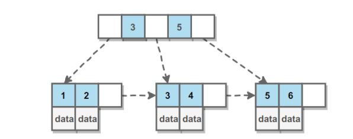
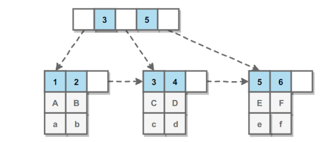
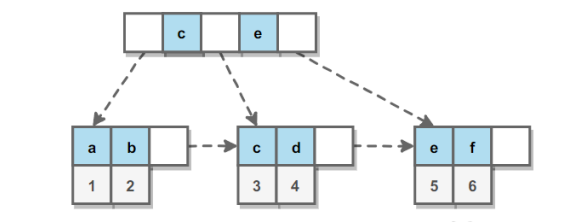
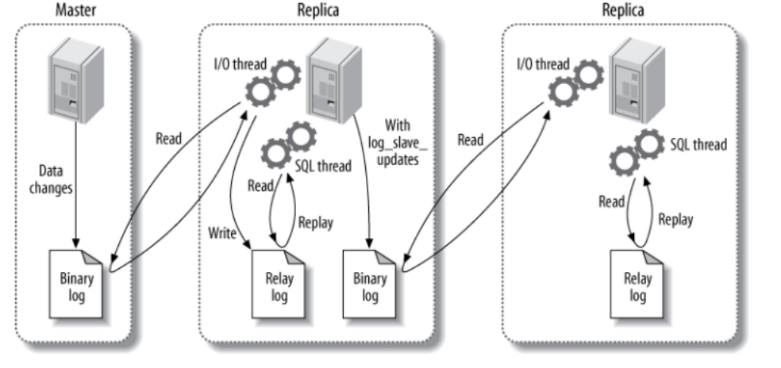
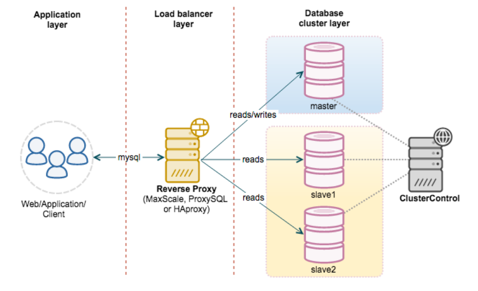

数据库

一、事务

1、概念

事务指的是满足 ACID 特性的一组操作，可以通过 Commit 提交一个事务，也可以使用 Rollback 进行回滚。

2、事务的四个特性

**ACID**

**1.** **原子性（Atomicity）**

事务被视为不可分割的最小单元，事务的所有操作要么全部提交成功，要么全部失败回滚。

回滚可以用回滚日志来实现，回滚日志记录着事务所执行的修改操作，在回滚时反向执行这些修改操作即可。

**2.** **一致性（Consistency）**

数据库在事务执行前后都保持一致性状态。在一致性状态下，所有事务对一个数据的读取结果都是相同的。

3.**隔离性（Isolation）**

一个事务所做的修改在最终提交以前，对其它事务是不可见的。

**4.** **持久性（Durability）**

一旦事务提交，则其所做的修改将会永远保存到数据库中。即使系统发生崩溃，事务执行的结果也不能丢失。

使用重做日志来保证持久性

*只有满足一致性，事务的执行结果才是正确的。

*在无并发的情况下，事务串行执行，隔离性一定能够满足。此时只要能满足原子性，就一定能满足一致性。

*在并发的情况下，多个事务并行执行，事务不仅要满足原子性，还需要满足隔离性，才能满足一致性。

*事务满足持久化是为了能应对数据库崩溃的情况。

**在并发环境下，事务的隔离性很难保证，因此会出现很多并发一致性问题。**

比如**丢失修改**，**读脏数据**，**不可重复读**，**幻读**

**丢失修改**：T1 和 T2 两个事务都对一个数据进行修改，T1 先修改，T2 随后修改，T2 的修改覆盖了 T1 的修改。

**读脏数据**“：T1 修改一个数据，T2 随后读取这个数据。如果 T1 撤销了这次修改，那么 T2 读取的数据是脏数据。

**不可重复读**：T2 读取一个数据，T1 对该数据做了修改。如果 T2 再次读取这个数据，此时读取的结果和第一次读取的结果不同。

**幻读**：T1 读取某个范围的数据，T2 在这个范围内插入新的数据，T1 再次读取这个范围的数据，此时读取的结果和和第一次

读取的结果不同。

3、封锁

产生并发不一致性问题主要原因是**破坏了事务的隔离性**，解决方法是通过**并发控制**来保证隔离性。并发控制可以通过

封锁来实现，但是封锁操作需要用户自己控制，相当复杂。**数据库管理系统**提供了事务的隔离级别，让用户以一种更

轻松的方式处理并发一致性问题。

**封锁粒度**：

MySQL 中提供了两种封锁粒度：行级锁以及表级锁。

应该尽量只锁定需要修改的那部分数据，而不是所有的资源。锁定的数据量越少，发生锁争用的可能就越小，系统的

并发程度就越高。

但是加锁需要消耗资源，锁的各种操作（包括获取锁、释放锁、以及检查锁状态）都会增加系统开销。因此封锁粒度

越小，系统开销就越大。

因此，在选择封锁粒度时，需要在锁开销和并发程度之间做一个权衡。

**封锁类型**

**1.** **读写锁**

排它锁（Exclusive），简写为 X 锁，又称写锁。

共享锁（Shared），简写为 S 锁，又称读锁。

有以下两个规定：

一个事务对数据对象 A 加了 X 锁，就可以对 A 进行读取和更新。加锁期间其它事务不能对 A 加任何锁。

一个事务对数据对象 A 加了 S 锁，可以对 A 进行读取操作，但是不能进行更新操作。加锁期间其它事务能对 A

加 S 锁，但是不能加 X 锁。

**2.** **意向锁**

使用意向锁（Intention Locks）可以更容易地支持多粒度封锁。

在存在行级锁和表级锁的情况下，事务 T 想要对表 A 加 X 锁，就需要先检测是否有其它事务对表 A 或者表 A 中的任

意一行加了锁，那么就需要对表 A 的每一行都检测一次，这是非常耗时的。

意向锁在原来的 X/S 锁之上引入了 IX/IS，IX/IS 都是表锁，用来表示一个事务想要在表中的某个数据行上加 X 锁或 S

锁。有以下两个规定：

一个事务在获得某个数据行对象的 S 锁之前，必须先获得表的 IS 锁或者更强的锁；

一个事务在获得某个数据行对象的 X 锁之前，必须先获得表的 IX 锁。

通过引入意向锁，事务 T 想要对表 A 加 X 锁，只需要先检测是否有其它事务对表 A 加了 X/IX/S/IS 锁，如果加了就表

示有其它事务正在使用这个表或者表中某一行的锁，因此事务 T 加 X 锁失败。

**封锁协议**

**1.** **三级封锁协议**

**一级封锁协议**

事务 T 要修改数据 A 时必须加 X 锁，直到 T 结束才释放锁。

可以解决丢失修改问题，因为不能同时有两个事务对同一个数据进行修改，那么事务的修改就不会被覆盖。

**二级封锁协议**

在一级的基础上，要求读取数据 A 时必须加 S 锁，读取完马上释放 S 锁。

可以解决读脏数据问题，因为如果一个事务在对数据 A 进行修改，根据 1 级封锁协议，会加 X 锁，那么就不能再加 S

锁了，也就是不会读入数据。

**三级封锁协议**

在二级的基础上，要求读取数据 A 时必须加 S 锁，直到事务结束了才能释放 S 锁。

可以解决不可重复读的问题，因为读 A 时，其它事务不能对 A 加 X 锁，从而避免了在读的期间数据发生改变。

**2.** **两段锁协议**

加锁和解锁分为两个阶段进行。

可串行化调度是指，通过并发控制，使得并发执行的事务结果与某个串行执行的事务结果相同。

事务遵循两段锁协议是保证可串行化调度的充分条件。例如以下操作满足两段锁协议，它是可串行化调度。

lock-x(A)...lock-s(B)...lock-s(C)...unlock(A)...unlock(C)...unlock(B)

但不是必要条件，例如以下操作不满足两段锁协议，但是它还是可串行化调度。

lock-x(A)...unlock(A)...lock-s(B)...unlock(B)...lock-s(C)...unlock(C)

**MySQL** **隐式与显示锁定**

MySQL 的 InnoDB 存储引擎采用两段锁协议，会根据隔离级别在需要的时候自动加锁，并且所有的锁都是在同一时

刻被释放，这被称为隐式锁定。

InnoDB 也可以使用特定的语句进行显示锁定：

SELECT ... LOCK In SHARE MODE; 

SELECT ... FOR UPDATE;

**四、隔离级别**

**未提交读（****READ UNCOMMITTED****）**

事务中的修改，即使没有提交，对其它事务也是可见的。

**提交读（****READ COMMITTED****）**

一个事务只能读取已经提交的事务所做的修改。换句话说，一个事务所做的修改在提交之前对其它事务是不可见的。

**可重复读（****REPEATABLE READ****）**

保证在同一个事务中多次读取同样数据的结果是一样的。

**可串行化（****SERIALIZABLE****）**

强制事务串行执行。

需要加锁实现，而其它隔离级别通常不需要。

**五、多版本并发控制**

多版本并发控制（Multi-Version Concurrency Control, MVCC）是 MySQL 的 InnoDB 存储引擎实现隔离级别的一种

具体方式，用于实现提交读和可重复读这两种隔离级别。而未提交读隔离级别总是读取最新的数据行，无需使用

MVCC。可串行化隔离级别需要对所有读取的行都加锁，单纯使用 MVCC 无法实现。

**版本号**

系统版本号：是一个递增的数字，每开始一个新的事务，系统版本号就会自动递增。

事务版本号：事务开始时的系统版本号。

**隐藏的列**

MVCC 在每行记录后面都保存着两个隐藏的列，用来存储两个版本号：

创建版本号：指示创建一个数据行的快照时的系统版本号；

删除版本号：如果该快照的删除版本号大于当前事务版本号表示该快照有效，否则表示该快照已经被删除了。

**Undo** **日志**

MVCC 使用到的快照存储在 Undo 日志中，该日志通过回滚指针把一个数据行（Record）的所有快照连接起来。

**实现可重复读过程**

当开始一个事务时，该事务的版本号肯定大于当前所有数据行快照的创建版本号，理解这一点很关键。数据行快照的

创建版本号是创建数据行快照时的系统版本号，系统版本号随着创建事务而递增，因此新创建一个事务时，这个事务

的系统版本号比之前的系统版本号都大，也就是比所有数据行快照的创建版本号都大。

**1. SELECT**

多个事务必须读取到同一个数据行的快照，并且这个快照是距离现在最近的一个有效快照。但是也有例外，如果有一

个事务正在修改该数据行，那么它可以读取事务本身所做的修改，而不用和其它事务的读取结果一致。

把没有对一个数据行做修改的事务称为 T，T 所要读取的数据行快照的创建版本号必须小于 T 的版本号，因为如果大

于或者等于 T 的版本号，那么表示该数据行快照是其它事务的最新修改，因此不能去读取它。除此之外，T 所要读取

的数据行快照的删除版本号必须大于 T 的版本号，因为如果小于等于 T 的版本号，那么表示该数据行快照是已经被删

除的，不应该去读取它。

**2. INSERT**

将当前系统版本号作为数据行快照的创建版本号。

**3. DELETE**

将当前系统版本号作为数据行快照的删除版本号。

**4. UPDATE**

将当前系统版本号作为更新前的数据行快照的删除版本号，并将当前系统版本号作为更新后的数据行快照的创建版本

号。可以理解为先执行 DELETE 后执行 INSERT

**快照读与当前读**

**1.** **快照读**

使用 MVCC 读取的是快照中的数据，这样可以减少加锁所带来的开销。

select * from table ...;

**2.** **当前读**

读取的是最新的数据，需要加锁。以下第一个语句需要加 S 锁，其它都需要加 X 锁。select * from table where ? lock in share mode; 

select * from table where ? for update; 

insert; 

update; 

delete;

**六、Next-Key Locks**

Next-Key Locks 是 MySQL 的 InnoDB 存储引擎的一种锁实现。

MVCC 不能解决幻影读问题，Next-Key Locks 就是为了解决这个问题而存在的。在可重复读（REPEATABLE READ）

隔离级别下，使用 MVCC + Next-Key Locks 可以解决幻读问题。

**Record Locks**

锁定一个记录上的索引，而不是记录本身。

如果表没有设置索引，InnoDB 会自动在主键上创建隐藏的聚簇索引，因此 Record Locks 依然可以使用。

**Gap Locks**

锁定索引之间的间隙，但是不包含索引本身。例如当一个事务执行以下语句，其它事务就不能在 t.c 中插入 15。 

SELECT c FROM t WHERE c BETWEEN 10 and 20 FOR UPDATE;

**Next-Key Locks**

它是 Record Locks 和 Gap Locks 的结合，不仅锁定一个记录上的索引，也锁定索引之间的间隙。例如一个索引包含

以下值：10, 11, 13, and 20，那么就需要锁定以下区间：

(-∞, 10] ,(10, 11] ,(11, 13] ,(13, 20] ,(20, +∞)

**七、关系数据库设计理论**

**函数依赖**

记 A->B 表示 A 函数决定 B，也可以说 B 函数依赖于 A。

如果 {A1，A2，... ，An} 是关系的一个或多个属性的集合，该集合函数决定了关系的其它所有属性并且是最小的，那

么该集合就称为键码。

对于 A->B，如果能找到 A 的真子集 A'，使得 A'-> B，那么 A->B 就是部分函数依赖，否则就是完全函数依赖。

对于 A->B，B->C，则 A->C 是一个传递函数依赖。

**异常**

学生课程关系的函数依赖为 {Sno, Cname} -> {Sname, Sdept, Mname, Grade}，键码为 {Sno, Cname}。也

就是说，确定学生和课程之后，就能确定其它信息。

不符合范式的关系，会产生很多异常，主要有以下四种异常：

冗余数据：例如 学生-2 出现了两次。

修改异常：修改了一个记录中的信息，但是另一个记录中相同的信息却没有被修改。

删除异常：删除一个信息，那么也会丢失其它信息。例如删除了 课程-1 需要删除第一行和第三行，那么 学 

生-1 的信息就会丢失。

插入异常：例如想要插入一个学生的信息，如果这个学生还没选课，那么就无法插入。

**范式**

范式理论是为了解决以上提到四种异常。

高级别范式的依赖于低级别的范式，1NF 是最低级别的范式。

**1.** **第一范式** **(1NF)**

属性不可分。

**2.** **第二范式** **(2NF)**

每个非主属性完全函数依赖于键码。

可以通过分解来满足.

**3.** **第三范式** **(3NF)**

非主属性不传递函数依赖于键码。

**八、ER图**

Entity-Relationship，有三个组成部分：实体、属性、联系。

用来进行关系型数据库系统的概念设计。

**实体的三种联系**

包含一对一，一对多，多对多三种。

如果 A 到 B 是一对多关系，那么画个带箭头的线段指向 B；

如果是一对一，画两个带箭头的线段；

如果是多对多，画两个不带箭头的线段。

下图的 Course 和 Student 是一对多的关系。

SQL

**一、基础**

模式定义了数据如何存储、存储什么样的数据以及数据如何分解等信息，数据库和表都有模式。

主键的值不允许修改，也不允许复用（不能将已经删除的主键值赋给新数据行的主键）。

SQL（Structured Query Language)，标准 SQL 由 ANSI 标准委员会管理，从而称为 ANSI SQL。各个 DBMS 都有自

己的实现，如 PL/SQL、Transact-SQL 等。

SQL 语句不区分大小写，但是数据库表名、列名和值是否区分依赖于具体的 DBMS 以及配置。

**0、SQL 支持以下三种注释:**

\# 注释 

SELECT * 

FROM mytable; -- 注释 

/* 注释1 

注释2 */ 

**1、数据库创建与使用：**

CREATE DATABASE test; 

USE test; 

**2、创建表**:

CREATE TABLE mytable ( 

\# int 类型，不为空，自增 

id INT NOT NULL AUTO_INCREMENT, 

\# int 类型，不可为空，默认值为 1，不为空 

col1 INT NOT NULL DEFAULT 1, 

\# 变长字符串类型，最长为 45 个字符，可以为空 

col2 VARCHAR(45) NULL, 

\# 日期类型，可为空 

col3 DATE NULL, 

\# 设置主键为 id 

PRIMARY KEY (`id`)); 

**3、修改表：**

添加列：

ALTER TABLE mytable 

ADD col CHAR(20);

删除列：

ALTER TABLE mytable 

DROP COLUMN col;

删除表：

DROP TABLE mytable;

**4、插入：**

普通插入

INSERT INTO mytable(col1, col2) 

VALUES(val1, val2);

插入检索出来的数据

INSERT INTO mytable1(col1, col2) 

SELECT col1, col2 

FROM mytable2;

将一个表的内容插入到一个新表

CREATE TABLE newtable AS 

SELECT * FROM mytable;

**5、更新：**

UPDATE mytable 

SET col = val 

WHERE id = 1;

**6、删除：**

DELETE FROM mytable 

WHERE id = 1;

**TRUNCATE TABLE** 可以清空表，也就是删除所有行。

TRUNCATE TABLE mytable;

使用更新和删除操作时一定要用 WHERE 子句，不然会把整张表的数据都破坏。可以先用 SELECT 语句进行测试，防

止错误删除。

**7、查询：**

**DISTINCT**

相同值只会出现一次。它作用于所有列，也就是说所有列的值都相同才算相同。

SELECT DISTINCT col1, col2 

FROM mytable;

**LIMIT**

限制返回的行数。可以有两个参数，第一个参数为起始行，从 0 开始；第二个参数为返回的总行数。

返回前 5 行：

SELECT * 

FROM mytable 

LIMIT 5; 

或者

SELECT * 

FROM mytable 

LIMIT 0, 5;

返回第 3 ~ 5 行：

SELECT * 

FROM mytable 

LIMIT 2, 3;

或者

SELECT *

FROM mytable

LIMIT 3 offset 3

**八、排序**

**ASC** ：升序（默认）

**DESC** ：降序

可以按多个列进行排序，并且为每个列指定不同的排序方式：

SELECT * 

FROM mytable 

ORDER BY col1 DESC, col2 ASC;

**九、过滤**

不进行过滤的数据非常大，导致通过网络传输了多余的数据，从而浪费了网络带宽。因此尽量使用 SQL 语句来过滤

不必要的数据，而不是传输所有的数据到客户端中然后由客户端进行过滤。

SELECT * 

FROM mytable 

WHERE col IS NULL;

应该注意到，NULL 与 0、空字符串都不同。

**AND** **和** **OR** 用于连接多个过滤条件。优先处理 AND，当一个过滤表达式涉及到多个 AND 和 OR 时，可以使用 () 来

决定优先级，使得优先级关系更清晰。

**IN** 操作符用于匹配一组值，其后也可以接一个 SELECT 子句，从而匹配子查询得到的一组值。

**NOT** 操作符用于否定一个条件.

**十、通配符**

通配符也是用在过滤语句中，但它只能用于文本字段。

**%** 匹配 >=0 个任意字符；

**_** 匹配 ==1 个任意字符；

**[ ]** 可以匹配集合内的字符，例如 [ab] 将匹配字符 a 或者 b。用脱字符 ^ 可以对其进行否定，也就是不匹配集合

内的字符。

使用 Like 来进行通配符匹配。

SELECT * 

FROM mytable 

WHERE col LIKE '[^AB]%'; -- 不以 A 和 B 开头的任意文本

不要滥用通配符，通配符位于开头处匹配会非常慢。

**十一、计算字段**

在数据库服务器上完成数据的转换和格式化的工作往往比客户端上快得多，并且转换和格式化后的数据量更少的话可

以减少网络通信量。

计算字段通常需要使用 **AS** 来取别名，否则输出的时候字段名为计算表达式。

SELECT col1 * col2 AS alias 

FROM mytable;

**CONCAT()** 用于连接两个字段。许多数据库会使用空格把一个值填充为列宽，因此连接的结果会出现一些不必要的空

格，使用 **TRIM()** 可以去除首尾空格。

SELECT CONCAT(TRIM(col1), '(', TRIM(col2), ')') AS concat_col 

FROM mytable;

**十二、函数**

各个 DBMS 的函数都是不相同的，因此不可移植，以下主要是 MySQL 的函数。

AVG() 

COUNT() 

MAX() 

MIN() 

SUM()

AVG() 会忽略 NULL 行。

使用 DISTINCT 可以汇总不同的值。

SELECT AVG(DISTINCT col1) AS avg_col 

FROM mytable;

**十三、分组**

把具有相同的数据值的行放在同一组中。

可以对同一分组数据使用汇总函数进行处理，例如求分组数据的平均值等。

指定的分组字段除了能按该字段进行分组，也会自动按该字段进行排序。

SELECT col, COUNT(*) AS num 

FROM mytable 

GROUP BY col;

GROUP BY 自动按分组字段进行排序，ORDER BY 也可以按汇总字段来进行排序。

SELECT col, COUNT(*) AS num 

FROM mytable 

GROUP BY col 

ORDER BY num;

WHERE 过滤行，HAVING 过滤分组，行过滤应当先于分组过滤。

SELECT col, COUNT(*) AS num 

FROM mytable 

WHERE col > 2 

GROUP BY col 

HAVING num >= 2;

分组规定：

GROUP BY 子句出现在 WHERE 子句之后，ORDER BY 子句之前；

除了汇总字段外，SELECT 语句中的每一字段都必须在 GROUP BY 子句中给出；

NULL 的行会单独分为一组；

大多数 SQL 实现不支持 GROUP BY 列具有可变长度的数据类型。

**十四、子查询**

子查询中只能返回一个字段的数据。

可以将子查询的结果作为 WHRER 语句的过滤条件：

SELECT * 

FROM mytable1 

WHERE col1 IN (SELECT col2 

FROM mytable2);

下面的语句可以检索出客户的订单数量，子查询语句会对第一个查询检索出的每个客户执行一次：

SELECT cust_name, (SELECT COUNT(*) 

FROM Orders 

WHERE Orders.cust_id = Customers.cust_id) 

AS orders_num 

FROM Customers 

ORDER BY cust_name

**十五、连接**

连接用于连接多个表，使用 JOIN 关键字，并且条件语句使用 ON 而不是 WHERE。

连接可以替换子查询，并且比子查询的效率一般会更快。

可以用 AS 给列名、计算字段和表名取别名，给表名取别名是为了简化 SQL 语句以及连接相同表。

**内连接**

内连接又称等值连接，使用 INNER JOIN 关键字。

SELECT A.value, B.value 

FROM tablea AS A INNER JOIN tableb AS B 

ON A.key = B.key;

可以不明确使用 INNER JOIN，而使用普通查询并在 WHERE 中将两个表中要连接的列用等值方法连接起来。

SELECT A.value, B.value 

FROM tablea AS A, tableb AS B 

WHERE A.key = B.key;

**自连接**

自连接可以看成内连接的一种，只是连接的表是自身而已。

一张员工表，包含员工姓名和员工所属部门，要找出与 Jim 处在同一部门的所有员工姓名。

子查询版本

SELECT name 

FROM employee 

WHERE department = ( 

SELECT department 

FROM employee 

WHERE name = "Jim");

自连接版本

SELECT e1.name 

FROM employee AS e1 INNER JOIN employee AS e2 

ON e1.department = e2.department 

AND e2.name = "Jim";

**十六、组合查询**

使用 **UNION** 来组合两个查询，如果第一个查询返回 M 行，第二个查询返回 N 行，那么组合查询的结果一般为

M+N 行。

每个查询必须包含相同的列、表达式和聚集函数。

默认会去除相同行，如果需要保留相同行，使用 UNION ALL。

只能包含一个 ORDER BY 子句，并且必须位于语句的最后。

SELECT col 

FROM mytable 

WHERE col = 1 

UNION 

SELECT col 

FROM mytable 

WHERE col =2;

**十七、视图**

视图是虚拟的表，本身不包含数据，也就不能对其进行索引操作。

对视图的操作和对普通表的操作一样。

视图具有如下好处：

简化复杂的 SQL 操作，比如复杂的连接；

只使用实际表的一部分数据；

通过只给用户访问视图的权限，保证数据的安全性；更改数据格式和表示。

CREATE VIEW myview AS 

SELECT Concat(col1, col2) AS concat_col, col3*col4 AS compute_col 

FROM mytable 

WHERE col5 = val;

**十八、存储过程**

存储过程可以看成是对一系列 SQL 操作的批处理。

使用存储过程的好处：

代码封装，保证了一定的安全性；

代码复用；

由于是预先编译，因此具有很高的性能。

命令行中创建存储过程需要自定义分隔符，因为命令行是以 ; 为结束符，而存储过程中也包含了分号，因此会错误把

这部分分号当成是结束符，造成语法错误。

包含 in、out 和 inout 三种参数。

给变量赋值都需要用 select into 语句。

每次只能给一个变量赋值，不支持集合的操作。

delimiter // 

create procedure myprocedure( out ret int ) 

begin

declare y int; 

select sum(col1) 

from mytable 

into y; 

select y*y into ret; 

end // 

delimiter ; 

call myprocedure(@ret); 

select @ret;

**十九、游标**

在存储过程中使用游标可以对一个结果集进行移动遍历。

游标主要用于交互式应用，其中用户需要对数据集中的任意行进行浏览和修改。

使用游标的四个步骤：

\1. 声明游标，这个过程没有实际检索出数据；

\2. 打开游标；

\3. 取出数据；4. 关闭游标；

delimiter // 

create procedure myprocedure(out ret int) 

begin

declare done boolean default 0; 

declare mycursor cursor for 

select col1 from mytable; 

\# 定义了一个 continue handler，当 sqlstate '02000' 这个条件出现时，会执行 set done = 1 

declare continue handler for sqlstate '02000' set done = 1; 

open mycursor; 

repeat

fetch mycursor into ret; 

select ret; 

until done end repeat; 

close mycursor; 

end // 

delimiter ;

**二十、触发器**

触发器会在某个表执行以下语句时而自动执行：DELETE、INSERT、UPDATE。

触发器必须指定在语句执行之前还是之后自动执行，之前执行使用 BEFORE 关键字，之后执行使用 AFTER 关键字。

BEFORE 用于数据验证和净化，AFTER 用于审计跟踪，将修改记录到另外一张表中。

INSERT 触发器包含一个名为 NEW 的虚拟表。

CREATE TRIGGER mytrigger AFTER INSERT ON mytable 

FOR EACH ROW SELECT NEW.col into @result; 

SELECT @result; -- 获取结果

DELETE 触发器包含一个名为 OLD 的虚拟表，并且是只读的。

UPDATE 触发器包含一个名为 NEW 和一个名为 OLD 的虚拟表，其中 NEW 是可以被修改的，而 OLD 是只读的。

MySQL 不允许在触发器中使用 CALL 语句，也就是不能调用存储过程。

**二十一、事务管理**

基本术语：

事务（transaction）指一组 SQL 语句；

回退（rollback）指撤销指定 SQL 语句的过程；

提交（commit）指将未存储的 SQL 语句结果写入数据库表；

保留点（savepoint）指事务处理中设置的临时占位符（placeholder），你可以对它发布回退（与回退整个事

务处理不同）。不能回退 SELECT 语句，回退 SELECT 语句也没意义；也不能回退 CREATE 和 DROP 语句。

MySQL 的事务提交默认是隐式提交，每执行一条语句就把这条语句当成一个事务然后进行提交。当出现 START

TRANSACTION 语句时，会关闭隐式提交；当 COMMIT 或 ROLLBACK 语句执行后，事务会自动关闭，重新恢复隐式

提交。

设置 autocommit 为 0 可以取消自动提交；autocommit 标记是针对每个连接而不是针对服务器的。

如果没有设置保留点，ROLLBACK 会回退到 START TRANSACTION 语句处；如果设置了保留点，并且在 ROLLBACK

中指定该保留点，则会回退到该保留点。

START TRANSACTION 

// ... 

SAVEPOINT delete1 

// ... 

ROLLBACK TO delete1 

// ... 

COMMIT

**二十二、字符集**

基本术语：

字符集为字母和符号的集合；

编码为某个字符集成员的内部表示；

校对字符指定如何比较，主要用于排序和分组。

除了给表指定字符集和校对外，也可以给列指定：

CREATE TABLE mytable 

(col VARCHAR(10) CHARACTER SET latin COLLATE latin1_general_ci ) 

DEFAULT CHARACTER SET hebrew COLLATE hebrew_general_ci;

可以在排序、分组时指定校对：

SELECT * 

FROM mytable 

ORDER BY col COLLATE latin1_general_ci;

**二十三、权限管理**

MySQL 的账户信息保存在 mysql 这个数据库中。

USE mysql; 

SELECT user FROM user;

**创建账户**

新创建的账户没有任何权限。

CREATE USER myuser IDENTIFIED BY 'mypassword';**修改账户名**

RENAME myuser TO newuser;

**删除账户**

DROP USER myuser;

**查看权限**

SHOW GRANTS FOR myuser;

**授予权限**

账户用 username@host 的形式定义，username@% 使用的是默认主机名。

GRANT SELECT, INSERT ON mydatabase.* TO myuser;

**删除权限**

GRANT 和 REVOKE 可在几个层次上控制访问权限：

整个服务器，使用 GRANT ALL 和 REVOKE ALL；

整个数据库，使用 ON database.*；

特定的表，使用 ON database.table；

特定的列；

特定的存储过程。

REVOKE SELECT, INSERT ON mydatabase.* FROM myuser;

**更改密码**

必须使用 Password() 函数进行加密。

SET PASSWROD FOR myuser = Password('new_password');

**MySQL**

**B+ Tree** **原理**

**1.** **数据结构**

B Tree 指的是 Balance Tree，也就是平衡树。平衡树是一颗查找树，并且所有叶子节点位于同一层。

B+ Tree 是基于 B Tree 和叶子节点顺序访问指针进行实现，它具有 B Tree 的平衡性，并且通过顺序访问指针来提高

区间查询的性能。

在 B+ Tree 中，一个节点中的 key 从左到右非递减排列，如果某个指针的左右相邻 key 分别是 keyi 和 keyi+1，且不

为 null，则该指针指向节点的所有 key 大于等于 keyi 且小于等于 keyi+1。

**2.** **操作**

进行查找操作时，首先在根节点进行二分查找，找到一个 key 所在的指针，然后递归地在指针所指向的节点进行查

找。直到查找到叶子节点，然后在叶子节点上进行二分查找，找出 key 所对应的 data。插入删除操作会破坏平衡树的平衡性，因此在插入删除操作之后，需要对树进行一个分裂、合并、旋转等操作来维护

平衡性。

**3.** **与红黑树的比较**

红黑树等平衡树也可以用来实现索引，但是文件系统及数据库系统普遍采用 B+ Tree 作为索引结构，主要有以下两个

原因：

（一）更少的查找次数

平衡树查找操作的时间复杂度和树高 h 相关，O(h)=O(logdN)，其中 d 为每个节点的出度。

红黑树的出度为 2，而 B+ Tree 的出度一般都非常大，所以红黑树的树高 h 很明显比 B+ Tree 大非常多，查找的次数

也就更多。

（二）利用磁盘预读特性

为了减少磁盘 I/O 操作，磁盘往往不是严格按需读取，而是每次都会预读。预读过程中，磁盘进行顺序读取，顺序读

取不需要进行磁盘寻道，并且只需要很短的磁盘旋转时间，速度会非常快。

操作系统一般将内存和磁盘分割成固定大小的块，每一块称为一页，内存与磁盘以页为单位交换数据。数据库系统将

索引的一个节点的大小设置为页的大小，使得一次 I/O 就能完全载入一个节点。并且可以利用预读特性，相邻的节点

也能够被预先载入。

**MySQL** **索引**

索引是在存储引擎层实现的，而不是在服务器层实现的，所以不同存储引擎具有不同的索引类型和实现。

**1. B+Tree** **索引**

是大多数 MySQL 存储引擎的默认索引类型。

因为不再需要进行全表扫描，只需要对树进行搜索即可，所以查找速度快很多。

因为 B+ Tree 的有序性，所以除了用于查找，还可以用于排序和分组。

可以指定多个列作为索引列，多个索引列共同组成键。

适用于全键值、键值范围和键前缀查找，其中键前缀查找只适用于最左前缀查找。如果不是按照索引列的顺序进行查

找，则无法使用索引。

InnoDB 的 B+Tree 索引分为主索引和辅助索引。主索引的叶子节点 data 域记录着完整的数据记录，这种索引方式被

称为聚簇索引。因为无法把数据行存放在两个不同的地方，所以一个表只能有一个聚簇索引。

辅助索引的叶子节点的 data 域记录着主键的值，因此在使用辅助索引进行查找时，需要先查找到主键值，然后再到

主索引中进行查找。

**2.** **哈希索引**

哈希索引能以 O(1) 时间进行查找，但是失去了有序性：

无法用于排序与分组；

只支持精确查找，无法用于部分查找和范围查找。

InnoDB 存储引擎有一个特殊的功能叫“自适应哈希索引”，当某个索引值被使用的非常频繁时，会在 B+Tree 索引之

上再创建一个哈希索引，这样就让 B+Tree 索引具有哈希索引的一些优点，比如快速的哈希查找。

**3.** **全文索引**

MyISAM 存储引擎支持全文索引，用于查找文本中的关键词，而不是直接比较是否相等。

查找条件使用 MATCH AGAINST，而不是普通的 WHERE。

全文索引使用倒排索引实现，它记录着关键词到其所在文档的映射。

InnoDB 存储引擎在 MySQL 5.6.4 版本中也开始支持全文索引。

**4.** **空间数据索引**

MyISAM 存储引擎支持空间数据索引（R-Tree），可以用于地理数据存储。空间数据索引会从所有维度来索引数据，

可以有效地使用任意维度来进行组合查询。

必须使用 GIS 相关的函数来维护数据。

**索引优化**

**1.** **独立的列**

在进行查询时，索引列不能是表达式的一部分，也不能是函数的参数，否则无法使用索引。

例如下面的查询不能使用 actor_id 列的索引：

SELECT actor_id FROM sakila.actor WHERE actor_id + 1 = 5;

**2.** **多列索引**

在需要使用多个列作为条件进行查询时，使用多列索引比使用多个单列索引性能更好。例如下面的语句中，最好把

actor_id 和 fifilm_id 设置为多列索引。SELECT film_id, actor_ id FROM sakila.film_actor 

WHERE actor_id = 1 AND film_id = 1;

**3.** **索引列的顺序**

让选择性最强的索引列放在前面。

索引的选择性是指：不重复的索引值和记录总数的比值。最大值为 1，此时每个记录都有唯一的索引与其对应。选择

性越高，每个记录的区分度越高，查询效率也越高。

例如下面显示的结果中 customer_id 的选择性比 staffff_id 更高，因此最好把 customer_id 列放在多列索引的前面。

SELECT COUNT(DISTINCT staff_id)/COUNT(*) AS staff_id_selectivity, 

COUNT(DISTINCT customer_id)/COUNT(*) AS customer_id_selectivity, 

COUNT(*) 

FROM payment; 

staff_id_selectivity: 0.0001 

customer_id_selectivity: 0.0373 

COUNT(*): 16049

**4.** **前缀索引**

对于 BLOB、TEXT 和 VARCHAR 类型的列，必须使用前缀索引，只索引开始的部分字符。

前缀长度的选取需要根据索引选择性来确定。

**5.** **覆盖索引**

索引包含所有需要查询的字段的值。

具有以下优点：

索引通常远小于数据行的大小，只读取索引能大大减少数据访问量。

一些存储引擎（例如 MyISAM）在内存中只缓存索引，而数据依赖于操作系统来缓存。因此，只访问索引可以

不使用系统调用（通常比较费时）。

对于 InnoDB 引擎，若辅助索引能够覆盖查询，则无需访问主索引。

**索引的优点**

大大减少了服务器需要扫描的数据行数。

帮助服务器避免进行排序和分组，以及避免创建临时表（B+Tree 索引是有序的，可以用于 ORDER BY 和

GROUP BY 操作。临时表主要是在排序和分组过程中创建，不需要排序和分组，也就不需要创建临时表）。

将随机 I/O 变为顺序 I/O（B+Tree 索引是有序的，会将相邻的数据都存储在一起）。

**索引的使用条件**

对于非常小的表、大部分情况下简单的全表扫描比建立索引更高效；

对于中到大型的表，索引就非常有效；

但是对于特大型的表，建立和维护索引的代价将会随之增长。这种情况下，需要用到一种技术可以直接区分出

需要查询的一组数据，而不是一条记录一条记录地匹配，例如可以使用分区技术。

**二、查询性能优化****使用** **Explain** **进行分析**

Explain 用来分析 SELECT 查询语句，开发人员可以通过分析 Explain 结果来优化查询语句。

比较重要的字段有：

select_type : 查询类型，有简单查询、联合查询、子查询等

key : 使用的索引

rows : 扫描的行数

**优化数据访问**

**1.** **减少请求的数据量**

只返回必要的列：最好不要使用 SELECT * 语句。

只返回必要的行：使用 LIMIT 语句来限制返回的数据。

缓存重复查询的数据：使用缓存可以避免在数据库中进行查询，特别在要查询的数据经常被重复查询时，缓存

带来的查询性能提升将会是非常明显的。

**2.** **减少服务器端扫描的行数**

最有效的方式是使用索引来覆盖查询。

**重构查询方式**

**1.** **切分大查询**

一个大查询如果一次性执行的话，可能一次锁住很多数据、占满整个事务日志、耗尽系统资源、阻塞很多小的但重要

的查询。

DELETE FROM messages WHERE create < DATE_SUB(NOW(), INTERVAL 3 MONTH); 

rows_affected = 0 

do {

rows_affected = do_query( 

"DELETE FROM messages WHERE create < DATE_SUB(NOW(), INTERVAL 3 MONTH) LIMIT 10000") 

} while rows_affected > 0

**2.** **分解大连接查询**

将一个大连接查询分解成对每一个表进行一次单表查询，然后在应用程序中进行关联，这样做的好处有：

让缓存更高效。对于连接查询，如果其中一个表发生变化，那么整个查询缓存就无法使用。而分解后的多个查

询，即使其中一个表发生变化，对其它表的查询缓存依然可以使用。

分解成多个单表查询，这些单表查询的缓存结果更可能被其它查询使用到，从而减少冗余记录的查询。

减少锁竞争；

在应用层进行连接，可以更容易对数据库进行拆分，从而更容易做到高性能和可伸缩。

查询本身效率也可能会有所提升。例如下面的例子中，使用 IN() 代替连接查询，可以让 MySQL 按照 ID 顺序进

行查询，这可能比随机的连接要更高效。SELECT * FROM tab 

JOIN tag_post ON tag_post.tag_id=tag.id 

JOIN post ON tag_post.post_id=post.id 

WHERE tag.tag='mysql'; 

SELECT * FROM tag WHERE tag='mysql'; 

SELECT * FROM tag_post WHERE tag_id=1234; 

SELECT * FROM post WHERE post.id IN (123,456,567,9098,8904);

**三、存储引擎**

**InnoDB**

是 MySQL 默认的事务型存储引擎，只有在需要它不支持的特性时，才考虑使用其它存储引擎。

实现了四个标准的隔离级别，默认级别是可重复读（REPEATABLE READ）。在可重复读隔离级别下，通过多版本并

发控制（MVCC）+ 间隙锁（Next-Key Locking）防止幻影读。

主索引是聚簇索引，在索引中保存了数据，从而避免直接读取磁盘，因此对查询性能有很大的提升。

内部做了很多优化，包括从磁盘读取数据时采用的可预测性读、能够加快读操作并且自动创建的自适应哈希索引、能

够加速插入操作的插入缓冲区等。

支持真正的在线热备份。其它存储引擎不支持在线热备份，要获取一致性视图需要停止对所有表的写入，而在读写混

合场景中，停止写入可能也意味着停止读取。

**MyISAM**

设计简单，数据以紧密格式存储。对于只读数据，或者表比较小、可以容忍修复操作，则依然可以使用它。

提供了大量的特性，包括压缩表、空间数据索引等。

不支持事务。

不支持行级锁，只能对整张表加锁，读取时会对需要读到的所有表加共享锁，写入时则对表加排它锁。但在表有读取

操作的同时，也可以往表中插入新的记录，这被称为并发插入（CONCURRENT INSERT）。

可以手工或者自动执行检查和修复操作，但是和事务恢复以及崩溃恢复不同，可能导致一些数据丢失，而且修复操作

是非常慢的。

如果指定了 DELAY_KEY_WRITE 选项，在每次修改执行完成时，不会立即将修改的索引数据写入磁盘，而是会写到内

存中的键缓冲区，只有在清理键缓冲区或者关闭表的时候才会将对应的索引块写入磁盘。这种方式可以极大的提升写

入性能，但是在数据库或者主机崩溃时会造成索引损坏，需要执行修复操作。

**比较**

事务：InnoDB 是事务型的，可以使用 Commit 和 Rollback 语句。

并发：MyISAM 只支持表级锁，而 InnoDB 还支持行级锁。

外键：InnoDB 支持外键。

备份：InnoDB 支持在线热备份。

崩溃恢复：MyISAM 崩溃后发生损坏的概率比 InnoDB 高很多，而且恢复的速度也更慢。

其它特性：MyISAM 支持压缩表和空间数据索引。

**四、复制**

**主从复制**

主要涉及三个线程：binlog 线程、I/O 线程和 SQL 线程。

**binlog** **线程** ：负责将主服务器上的数据更改写入二进制日志（Binary log）中。

**I/O** **线程** ：负责从主服务器上读取二进制日志，并写入从服务器的中继日志（Relay log）。

**SQL** **线程** ：负责读取中继日志，解析出主服务器已经执行的数据更改并在从服务器中重放（Replay）。

**读写分离**

主服务器处理写操作以及实时性要求比较高的读操作，而从服务器处理读操作。

读写分离能提高性能的原因在于：

主从服务器负责各自的读和写，极大程度缓解了锁的争用；

从服务器可以使用 MyISAM，提升查询性能以及节约系统开销；

增加冗余，提高可用性。

读写分离常用代理方式来实现，代理服务器接收应用层传来的读写请求，然后决定转发到哪个服务器。

